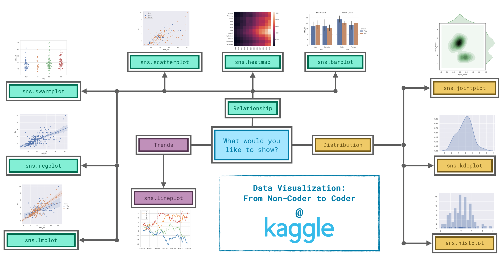

# 📌 Базовый функционал для анализа данных

## 🎨 Seaborn (`import seaborn as sns`)

### 🔹 Trends
- `sns.lineplot()`

### 🔹 Relationships
- `sns.barplot()`
- `sns.heatmap(…, annot=True)`
- `sns.scatterplot(…, hue=…)`
- `sns.regplot()`
- `sns.lmplot()`
- `sns.swarmplot()`

### 🔹 Distributions
- `sns.histplot(…, kde=True, fill=True)`
- `sns.jointplot(…, kind="kde")`
- `sns.kdeplot(…, fill=True)`

---

## 🐼 Pandas (`import pandas as pd`)

### 🔹 Базовая информация
- `df.describe()`
- `df.info()`
- `df.head()`
- `df.tail()`

### 🔹 Очистка и пропуски
- `df.drop()`
- `df.dropna()`
- `df.fillna()`
- `df.isnull()`
- `df.replace()`

### 🔹 Индексация
- `df.loc[]`
- `df.iloc[]`
- `df.at[]`

### 🔹 Агрегация
- `df.map()`
- `df.apply()`
- `df.agg()`

### 🔹 Группировка и сортировка
- `df.groupby(…)` → **MultiIndex** (помнить про параметр `level`)
- `df.sort_values()`

### 🔹 Даты и время
- `pd.to_datetime()`

### 🔹 Типы данных
- `df.astype()`
- `df.dtypes`

### 🔹 Масштабирование и нормализация
- **Min-Max scaling:**  
  \[(x - x_min) / (x_max - x_min)\]  
- **Standard normalization:**  
  \[(x - x_mean) / std(x)\]
